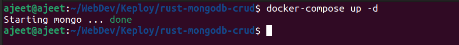
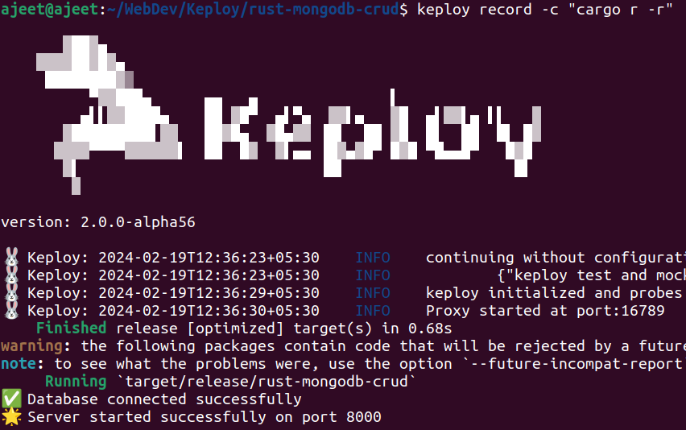
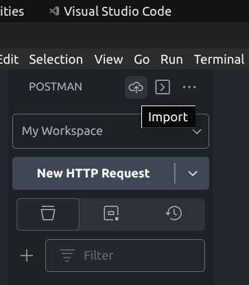
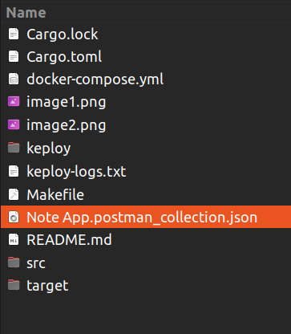
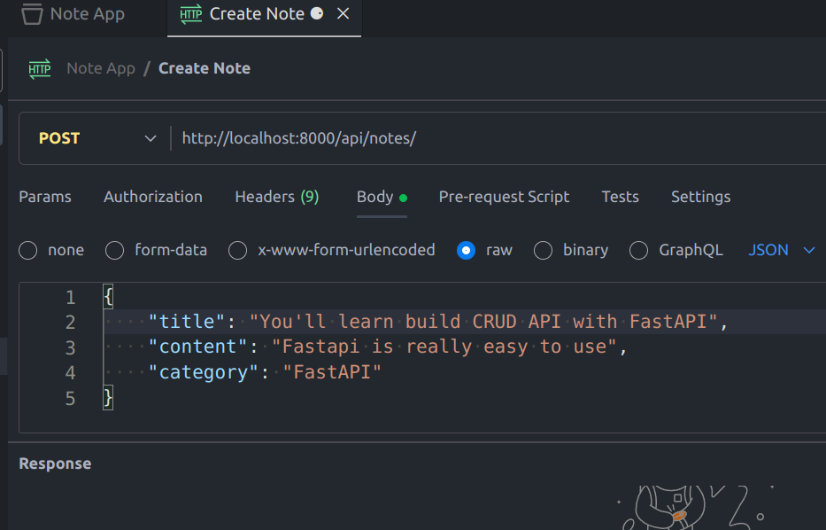
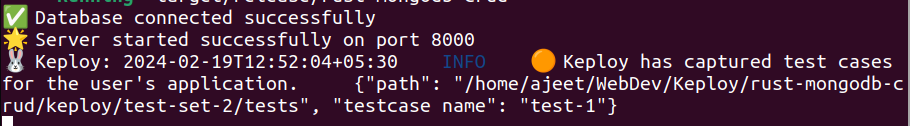
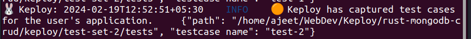
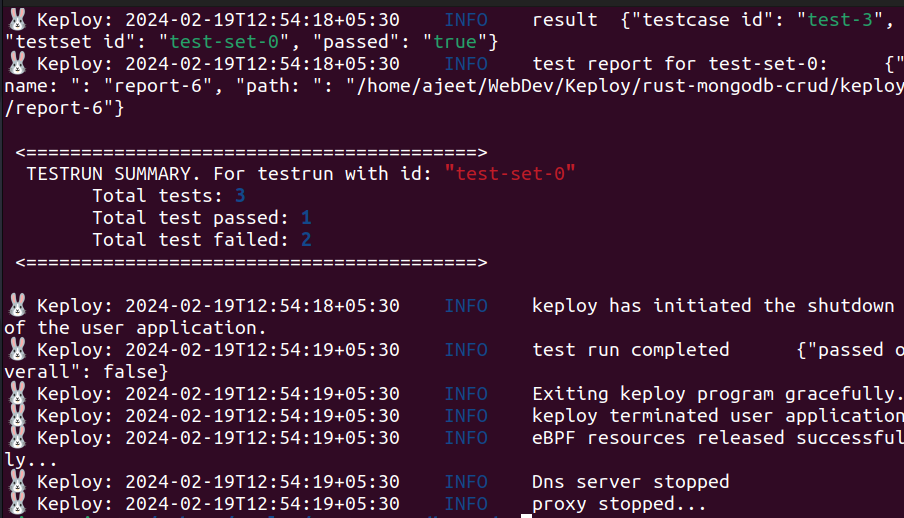

# Sample CRUD rest api in Rust and MongoDb

This is a sample app to showcase Keploy integration capabilities using rust and MongoDb.

## Setup app
Now that we have MongoDb & Docker installed, we will setup our application

```bash
git clone https://github.com/keploy/samples-rust
cd samples-rust/CRUD-rust-mongo
```
## Using Keploy :
Keploy can be installed on Linux directly and on Windows with the help of WSL. Based on your system architecture, install the keploy latest binary release from here:-

#### Linux
1. AMD Architecture
```zsh
curl --silent --location "https://github.com/keploy/keploy/releases/latest/download/keploy_linux_amd64.tar.gz" | tar xz -C /tmp

sudo mkdir -p /usr/local/bin && sudo mv /tmp/keploy /usr/local/bin && keploy
```

<details>
<Summary> 2. ARM Architecture </Summary>


```zsh
curl --silent --location "https://github.com/keploy/keploy/releases/latest/download/keploy_linux_arm64.tar.gz" | tar xz -C /tmp

sudo mkdir -p /usr/local/bin && sudo mv /tmp/keploy /usr/local/bin && keploy
```
</details>

### Let's start the MongoDB Instance
Open the root directory path in your terminal and then execute the following command:
```zsh
docker-compose up -d
```

## Capture testcase
On same terminal execute the following command:
```bash
keploy record -c 'cargo r -r'
```


### Generate testcase

Open Postman or any other tool, or utilize the Postman VSCode extension. Click on the import icon (shown below):



Import the file named: 

##### [ Note App.postman_collection.json ].




After that, Postman will display a similar window:



Create a POST request, and you will receive the following output in your terminal:



Afterward, create a GET all request, and you will get the following output in your terminal:



---

### Run the testcases
Once more, open the terminal with the path set to the root directory of the project.

Now, let's execute the deployment in test mode :
```bash
keploy test -c 'cargo r -r'
```

We get the following output in the terminal -


*Voila!! Our testcases has passed 🌟*