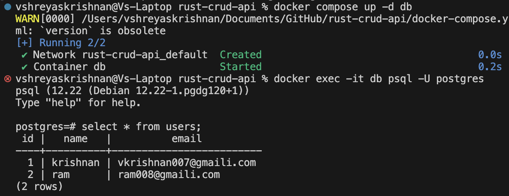
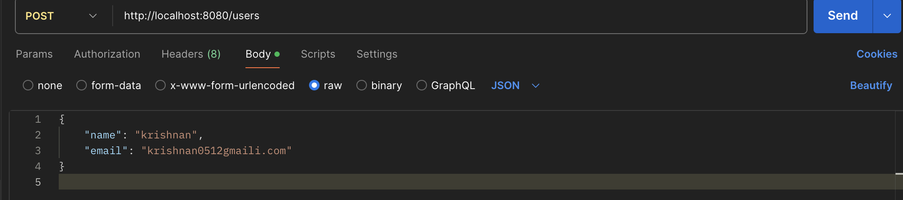
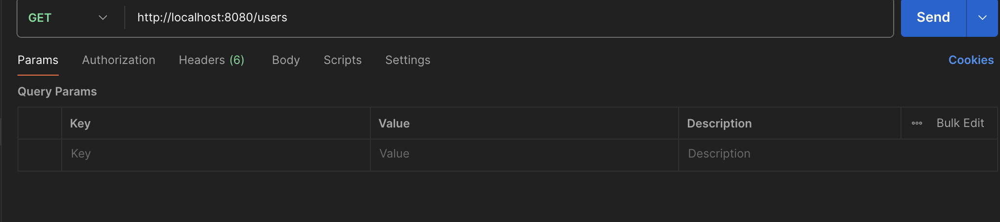
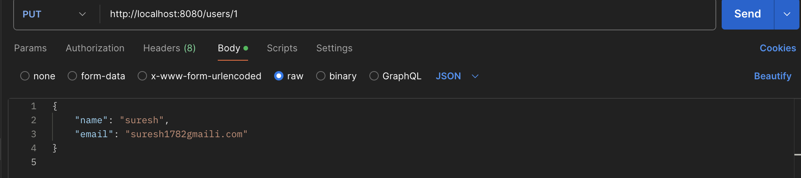
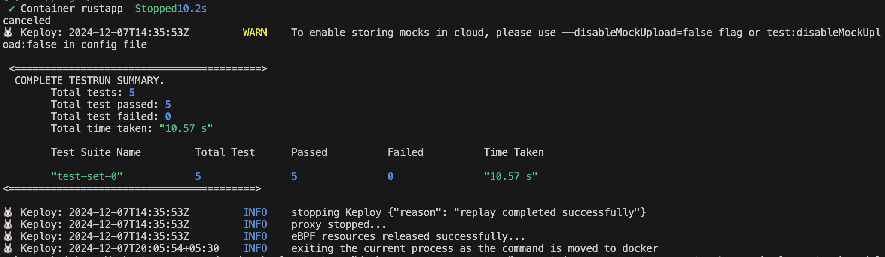

# Sample CRUD rest api in Rust and PostgreSQL

This is a sample app to showcase Keploy integration capabilities using rust and PostgreSQL.

## Setup app
Now that we have Rust and Docker installed, we will setup our application

```bash
git clone https://github.com/keploy/samples-rust
cd samples-rust/rust-crud-
```
## Using Keploy :
One-click curl command to install keploy:-

```zsh
curl --silent -O -L https://keploy.io/install.sh && source install.sh
```

### Let's start the PostgreSQL Instance
Open the root directory path in your terminal and then execute the following command:
```zsh
docker compose up -d db
docker exec -it db psql -U postgres
```

### Let's run the CRUD app
```zsh
docker compose build
docker compose up rustapp
```
## Capture testcase using Keploy

```bash
keploy record -c "docker compose up rustapp" --container-name rustapp --network-name keploy-network --debug --buildDelay 60
```


### Generate testcase

Open Postman or any other tool, or utilize the Postman VSCode extension. Run get, post and put commands in the postman command terminal.





---

### Run the testcases
Once more, open the terminal with the path set to the root directory of the project.

Now, let's execute the deployment in test mode :
```bash
keploy test -c "docker compose up rustapp" --container-name rustapp --network-name keploy-network --delay 10
```

We get the following output in the terminal -


*Voila!! Our testcases has passed 🌟*
